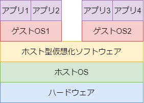
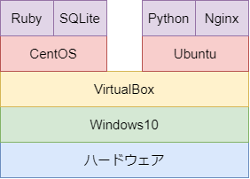
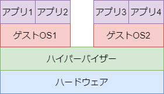
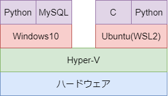
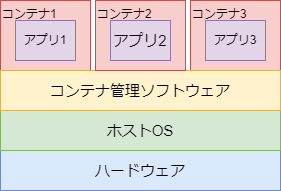
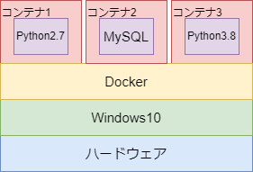

# Dockerのメモ

目次
 1. 目的
 2. Dockerの概念  
    2.1 サーバ仮想化  
    2.2 Dockerとは  
 3. 実行環境とDockerの環境構築
 4. Dockerの使い方  
    4.1 Hello World!  
    4.2 イメージとコンテナ  
    4.3 Dockerfile  
    4.4 docker-compose  

参考文献

## 1. 目的
研究やシステム開発, 趣味などで「とりあえず動作する環境が欲しい」「軽くソフトウェアやプログラミング言語に触りたい」という需要が増えてきている. また筆者に次のような要望・依頼を数件いただいている.
- Dockerの使い方を教えてほしい
- 仮想化技術を用いて開発環境を整えたい
- 複数コンテナを組み合わせて開発を行う方法が知りたい

この要望に対して仮想化技術, 特にDockerを用いて環境を整えることで難しい環境構築にコストをかけずに開発を始めることができる.
そこで仮想化技術の概念について理解し, Dockerを用いて環境構築を行うことを目的として本リポジトリを作成する. 読者のレベルとしては基本的なUnixコマンドが使えること, ネットワークに関する基礎的な知識を有していることを想定している.  
2章では仮想化技術としてサーバ仮想化について説明した後, Dockerとは何か簡単に説明する. 3章では本ドキュメントの実行環境と, Docker自体の環境構築に参考となるサイトの紹介を行う. 4章では実際にDockerを用いて開発環境を整える方法を紹介する. 環境構築ではチュートリアルイメージと公式イメージを動作させた後にDockerfileを用いて環境構築を行う方法と, docker-composeを用いて複数のイメージを組み合わせた環境を構築する方法について説明する.

## 2. Dockerの概念
本章ではDockerの概念としてサーバ仮想化とよびDockerの概要について説明する.

### 2.1 サーバ仮想化
仮想化技術とは物理構成(ハードウェア)の機能を論理構成(ソフトウェア)によって実現する技術である[1]. 仮想化技術の一つにサーバ仮想化と呼ばれる, 1台の物理サーバ上で複数の仮想的なサーバを動作指せる技術がある. サーバ仮想化にはホスト型仮想化, ハイパバイザ型仮想化, コンテナ型仮想化の3種類がある.  
ホスト型仮想化は次に示すような構成でサーバ仮想化を行う方法である. ホスト型仮想化ではハードウェア上で動作するホストOSに, 仮想化ソフトウェアをインストールする. そして仮想化ソフトウェア上でゲストOSを動作させ, ゲストOSでアプリケーションが動作する. 

ホスト型仮想化でサーバ仮想化を行った環境の例を次に示す. この例ではハードウェアに搭載されているWindows10上に仮想化ソフトウェアとしてVirtualBox[1]をインストールしている. VirtulBoxではCentOSとUbuntuの2つのゲストOSが動作している. CentOSではRubyとSQLite, UbuntuではPythonとNginxのアプリケーションが動作している.

ホスト型仮想化のメリットは既存のマシンを利用してサーバ仮想化が行えること, 仮想化に必要なソフトウェアが扱いやすいことがあげられる. 一方デメリットとしては後述するハイパーバイザー型の仮想化ソフトウェアに比べて仮想サーバの動作が遅いこと, ホストOSを動作させるために物理リソースが必要であることがあげられる. リソース面, 動作速度面から本番環境に適しているとは言えないがテスト用の環境であれば問題なく使うことができる.  
次にハイパーバイザー型仮想化について説明する. ハイパーバイザー型仮想化は次に示すような構成でサーバ仮想化を行う方法である. 仮想化のためのOSのような役割としてハイパーバイザーがあり, ハイパーバイザー上でゲストOSが動作する. 

ハイパーバイザー型でサーバ仮想化を行った環境の例を次に示す. この例はWindowsでWindows Subsystem for Linux(WSL2)を利用するために, Hyper-Vと呼ばれるハイパーバイザー上にWindows10とUbuntuの2つのゲストOSを配置している[2][3].

ハイパーバイザー型仮想化のメリットはホストOSが不要でハードウェアを直接制御できること, システム全体としてリソースの使用効率がいいこと, 管理するサーバの台数削減が可能であることがあげられる. 一方でデメリットとして仮想化環境の高度な管理を実現するツールが標準装備されていないことがある, ハードウェアのスペックが低い場合は処理能力不足になることがある, 頻繁にアップデートが必要なものがあるため運用保守の観点にコストがかかることがあげられる.  
最後にコンテナ型仮想化について説明する. コンテナ型仮想化は次に示すような構成でサーバ仮想化を行う方法である. ハードウェアに搭載されたOS上にコンテナ管理ソフトウェア[4]をインストールし, コンテナと呼ばれる環境でアプリが動作する. ここまでの説明ではホスト型仮想化とほぼ同じであるように感じるが, 重要なのはコンテナの役割である. コンテナはアプリケーション実行環境を仮想化するためのもので, プロセッサやメモリの消費やストレージの負荷が軽量である. このため複数のコンテナを同時に動かすことができ, 起動や停止も高速で行える. 一方でデメリットとして複数のホストでのコンテナ運用が煩雑になること, カーネルを個別に変更できないこと, 新しい技術であるために学習コストが高いことが上げられる.

コンテナ型仮想化の例を次に示す. この例ではWindows10上にDockerと呼ばれるコンテナ管理ソフトウェアをインストールしている. そしてコンテナ管理ソフトウェアで3つのコンテナが動作する. コンテナ内ではPython2.7, MySQL, Python3.8の3つのアプリケーションが実行されている.

### 2.2 Dockerとは
前節で唐突に登場したが, Docker[5]はコンテナ管理ソフトウェアである. Dockerを用いることで1章の目的で筆者が受けた需要・要望に答えることができる.　「とりあえず動作する環境が欲しい」「軽くソフトウェアやプログラミング言語に触りたい」という需要は, Dockerを用いると配布されたベースイメージを使って簡単に軽量な環境を構築し, 必要が無くなればその環境を簡単に破棄するで満足することができる.  「仮想化技術を用いて開発環境を整えたい」「難しい環境構築にコストをかけたくない」という要望は, メジャーな言語やソフトウェアのベースイメージが配布されているので仮想化技術で開発環境を簡単に誰でも整えられる, Dockerfileに開発環境の設定を記述して配布すればどのOSでも同じ環境を構築することで満たすことができる. すなわち最初の開発者がDockerfileと開発に必要な一連のファイルを揃えておけば開発の引継ぎや, 初期段階での環境構築が簡単に行うことができる. 「複数コンテナを組み合わせて開発を行う方法が知りたい」という要望はdocker-compose.ymlに複数コンテナを組み合わせる設定を記述して, 実行することでコンテナを組み合わせることができるため満たすことができる. 複数コンテナを組み合わせるのはアプリケーション開発でフロントエンド, バックエンド, データベースをそれぞれ別のコンテナで構築するような場合に有用である.

## 3. 実行環境とDockerの環境構築
Dockerの使い方で使用する環境と, Dockerの環境構築に参考になる文献を紹介する. ここではWindows11上にインストールしたDocker Desktop for Windows[6]を用いる. コマンド操作はWSL2から行うものとする. 現在ではWSL2上にDockerの環境を構築することができるので参考文献[7]の方法でDockerをインストールすることができる.

## 4. Dockerの使い方
本章ではDockerの使い方として, Hello World! イメージとコンテナ, Dockerfile, docker-composeについて説明する. 
### 4.1 Hello World!
### 4.2 イメージとコンテナ
### 4.3 Dockerfile
### 4.4 docker-compose
## 参考文献

[1]アイティーエム, 仮想化技術について解説ホスト・ハイパーバイザー・コンテナの違いとは？  
https://www.itmanage.co.jp/column/virtualization-server-integration/

[2]atmarkit, 図解で理解できる（はず）Microsoftの仮想化技術――Windows上で稼働するLinux、動かしているのはどのテクノロジー？（その2）  
https://atmarkit.itmedia.co.jp/ait/articles/1710/24/news010.html

atmarkit, 完全なLinuxがWindows 10上で稼働する？　「WSL 2」とは  
[3]https://atmarkit.itmedia.co.jp/ait/articles/1906/14/news019.html

[4]大滝みや子, 岡嶋祐史, "令和04年【春期】【秋期】応用情報技術者合格教本", pp.195, 株式会社技術評論社, 2021

[5]Docker https://www.docker.com/

[6]Docker Desktop https://www.docker.com/products/docker-desktop/

[7]WSL2 Ubuntu に Docker をインストールする https://zenn.dev/fehde/articles/ea0e8a0a0a1de4